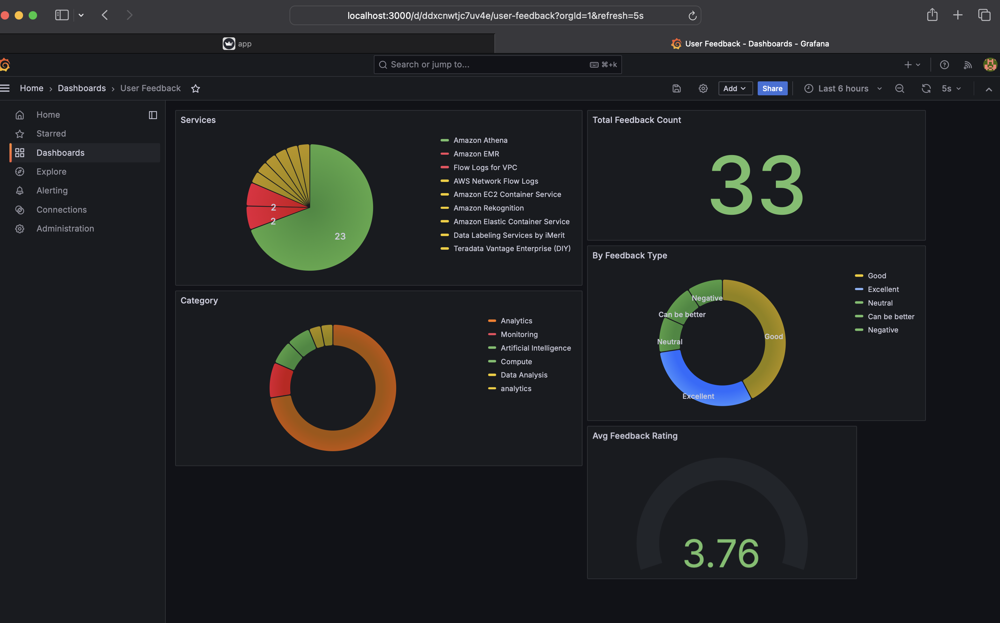

  

# llm-RAG-cloud-asset-service-categorization

  

A Retrieval-Augmented Generation (RAG) application designed to predict the category of cloud assets. This project integrates AI-based techniques to assist in finding relevant cloud asset service categories based on user queries.

  

## Features

  

- Predicts cloud asset service categories.

- Utilizes RAG architecture with **_LanceDB_** (for Vector Search) and **_ElasticSearch_**.

- Added support to use Open Source models locally using **_Ollama_**.

- Monitoring support to view dashboards.

  

## Table of Contents

  

- [Description](#description)

- [Features](#features)

- [Installation](#installation)

- [Usage](#usage)

- [Configuration](#configuration)

- [Contributing](#contributing)

- [License](#license)

  

## Description

  

### What is Cloud Asset Service Categorization?

  

Cloud Asset Service Categorization is the process of systematically classifying cloud resources and services into predefined categories. These categories can include:

  

- Compute resources (e.g., virtual machines, containers)

- Storage services (e.g., object storage, block storage)

- Networking components (e.g., load balancers, VPNs)

- Database services

- Security and identity management tools

- Analytics and big data services

- Developer tools and services

- AI and machine learning platforms

  

This categorization plays a crucial role in managing, optimizing, and securing cloud environments, particularly as businesses continue to migrate more of their operations to the cloud.

  

### Business Problem

  

Created a fictional businees usecase to explain the need of Cloud Asset Service Categorization.

Refer this [document](./setup-docs/cloud-asset-service-categorization.md) to check the business proposition.

  
  

### Prerequisites

- Docker

- Docker Compose

- Python 3.9+

  

## Installation

  

To set up this project locally, follow these steps:

  

1. Clone the repository:

```
git clone https://github.com/dusisarathchandra/llm-RAG-cloud-asset-service-categorization.git

cd llm-RAG-cloud-service-helper
```

  

2. Set up a virtual environment (recommended):

```

python -m venv env

source env/bin/activate # On Windows, use `env\Scripts\activate`

```

  

3. Install the required dependencies:

```

pip install -r requirements.txt

```

  

#### Set Up Docker Compose

- Follow this [link](./setup-docs/docker-compose-installation-guide.md) to install `docker-compose`

  

## Usage

  

#### 1. Start the docker-compose

- Make sure that you've access to run **`docker-compose`**

##### On Linux/Mac:

```

docker-compose up --build

```

  

##### On Windows:

Ensure Docker Desktop is installed. Open a terminal and run:

```

docker-compose up --build

```

  

#### 2. Confirm that the containers are running

  

-  ##### Via Docker Desktop

  

If you're using `Docker Desktop`, open it and make sure all the below containers are up and running.

  

1. grafana

2. postgres

3. elastic-search

4. Ollama

  

-  ##### Via Command line (lists all the docker containers)

```

docker ps -a

```

  

## Configuration

  

Once you're sure the setup is done. Visit the project base folder:

```
cd <path-to-cloned-project-folder>
```

Run

```
streamlit run app.py
```

  

### Accessing the app

  

- On your favorite browser visit http://localhost:8501.

- Upon visiting the page, you should see below screen.


  

### Accessing Grafana Monitoring Dashboard

- On your favorite browser visit http://localhost:3000

- Upon visiting the page, if you're asked to enter credentials, it's defaulted to below ones:

```

username: admin

password: admin

```

- Once you successfully authenticate, you'll be taken to homescreen like this:


  

- On the left panel, click on `Dashboards` -> `User Feedback`

- Your monitoring dashboard should look like this

>  *Note*: At first, there will be no data. As you begin using the app, all the monitoring dashboards will start to update.



  
  

## Contributing

  

Contributions to this project are welcome! Please follow these steps:

  

1. Fork the repository

2. Create a new branch: `git checkout -b feature-branch-name`

3. Make your changes and commit them: `git commit -m 'Add some feature'`

4. Push to the branch: `git push origin feature-branch-name`

5. Submit a pull request