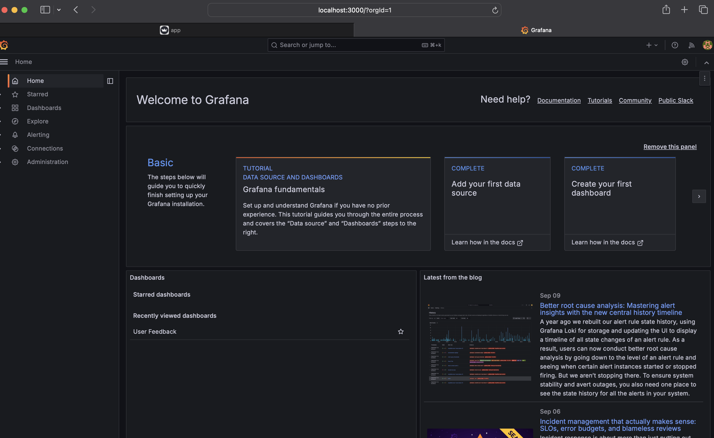

<!--- BADGES: START --->


<!--- BADGES: END --->

# llm-RAG-cloud-asset-service-categorization

A Retrieval-Augmented Generation (RAG) application designed to predict the category of cloud assets. This project integrates AI-based techniques to assist in finding relevant cloud asset service categories based on user queries.


## Deployed version of app in Cloud

You can access the deployed version of the app [here](https://llm-rag-cloud-asset-service-categorization.streamlit.app/). 
> Note: Providing User feedback & Monitoring dashboard is available only for the locally deployed version of app.

## Features  

- Predicts cloud asset service categories.

- Utilizes RAG architecture with [**_LanceDB_**](https://lancedb.github.io/lancedb/concepts/vector_search/) (for Vector Search) and **_ElasticSearch_**.

- Added support to use Open Source models locally using [**_Ollama_**](https://ollama.com/).

- [Monitoring](https://grafana.com/oss/grafana/) support to view dashboards.

  

## Table of Contents

  

- [Description](#description)

- [Features](#features)

- [Installation](#installation)

- [Usage](#usage)

- [Configuration](#configuration)

- [Project Evaluation](./setup-docs/project_evaluation.md)

- [Contributing](#contributing)


  

## Description

  

### What is Cloud Asset Service Categorization?

  

Cloud Asset Service Categorization is the process of systematically classifying cloud resources and services into predefined categories. These categories can include:

  

- Compute resources (e.g., virtual machines, containers)

- Storage services (e.g., object storage, block storage)

- Networking components (e.g., load balancers, VPNs)

- Database services

- Security and identity management tools

- Analytics and big data services

- Developer tools and services

- AI and machine learning platforms

  

This categorization plays a crucial role in managing, optimizing, and securing cloud environments, particularly as businesses continue to migrate more of their operations to the cloud.

  

### Business Problem

  

Created a fictional businees usecase to explain the need of Cloud Asset Service Categorization.

Refer this [document](./setup-docs/cloud-asset-service-categorization.md) to check the business proposition.

  
### System Information

The project is developed on a machine with these [specs](./setup-docs/system_specs.md)

### Prerequisites

- Docker

- Docker Compose

- Python 3.9+

  

## Installation

  

To set up this project locally, follow these steps:

  

1. Clone the repository:

```
git clone https://github.com/dusisarathchandra/llm-RAG-cloud-asset-service-categorization.git

cd llm-RAG-cloud-asset-service-categorization
```

  

2. Set up a virtual environment (recommended):

```

python -m venv env

source env/bin/activate

```

- On windows
```
source env\Scripts\activate
```

  

3. Install the required dependencies:

```

pip install -r requirements.txt

```

  

#### Set Up Docker Compose

- Follow this [link](./setup-docs/docker-compose-installation-guide.md) to install [**`docker-compose`**](https://docs.docker.com/compose/)

  

## Usage

  

#### 1. Start the docker-compose

- Make sure that you've access to run **`docker-compose`**

- Open a terminal and run the following

##### On Linux/Mac:

```

docker-compose up --build

```

  

##### On Windows:

Ensure Docker Desktop is installed. Open a terminal and run:

```

docker-compose up --build

```


* Don't close the terminal

#### 2. Confirm that the containers are running

  

-  ##### Via Docker Desktop

  

If you're using [`Docker Desktop`](https://docs.docker.com/desktop/install/mac-install/), open it and make sure all the below containers are up and running.

  

1. grafana

2. postgres

3. elastic-search

4. Ollama

  

#### 3. Configuration step to pull Ollama model. 
* Command line (lists all the docker containers)

Open another terminal and execute the below command.

```

docker ps -a

```

 - Copy the Ollama docker container id


## Configuration

#### (Optional) Manual Ingestion of data
> *Note:* Data is already ingested beforehand, if you want to manually ingest the data again, run the following command in a terminal with your virtual environment activated.

- Below command will start creating the embeddings and pushing the vectors to LanceDB.
```
python ingestion.py
```

### Pull the LLM model through Ollama

- Exec into Ollama docker container to pull the required model.
> *Note:* As part of this project, I have used `gemma2:2b`. We try to pull the same using Ollama.
- More about [gemma2:2b](https://ollama.com/library/gemma2)

```
docker exec -it <Ollama-Container-ID> bash
```
```
ollama pull gemma2:2b
```


- Confirm successfull pull of the model by running command `ollama list` (must list `gemma2:2b` model)


Once you're sure the setup is done. Visit the project base folder:

```
cd <path-to-cloned-project-folder>
```

Run

```
streamlit run app.py
```

  

### Accessing the app

  

- On your favorite browser visit http://localhost:8501.

- Upon visiting the page, you should see below screen.


> _Note_: If more than one model is running in Ollama container, the UI might through an error, either make sure you have more memory to hold all the docker containers or test with one model. 

### Accessing Grafana Monitoring Dashboard

> *Note*: Seen issue while accessing Grafana dashboard on Chrome. Please try different browsers if you get `Unauthorzied` error.

- On your favorite browser visit http://localhost:3000

- Upon visiting the page, if you're asked to enter credentials, it's defaulted to below ones:

```

username: admin

password: admin

```

Give a new password also as `admin`

- Once you successfully authenticate, you'll be taken to homescreen like this:



  

- On the left panel, click on `Dashboards` -> `User Feedback`

- Your monitoring dashboard should look like this

>  *Note*: At first, there will be no data. As you begin using the app, all the monitoring dashboards will start to update.


  
  

## Contributing

  

Contributions to this project are welcome! Please follow these steps:

  

1. Fork the repository

2. Create a new branch: `git checkout -b feature-branch-name`

3. Make your changes and commit them: `git commit -m 'Add some feature'`

4. Push to the branch: `git push origin feature-branch-name`

5. Submit a pull request